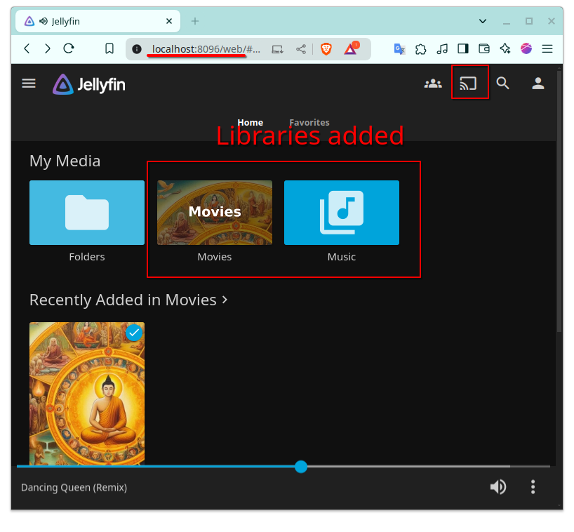

# JellyFin

Simple app for video and music

OpenSource project 
Using dockeritation to getUp the project

`docker-compose.yml` reference

https://jellyfin.org/docs/general/installation/container/#using-docker-compose

Note: I used the chmod 777 *.* into `/media` (videos) and `/media2` (musica)
I need to test this case for not use the 777 permission (but is necessary more time)
and this was really fast.

`Command useful` for get my ids: uid:gid in my case is 1000:1001

    id

## Start project by command

    docker-compose up

My demo user for my debug/testing it was: admin:admin
Open the app: http://localhost:8096/web
Download the app mobile too is kool work like spotify

